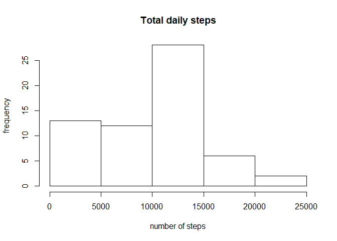
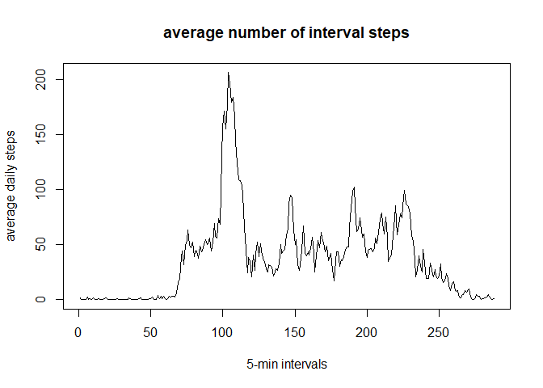
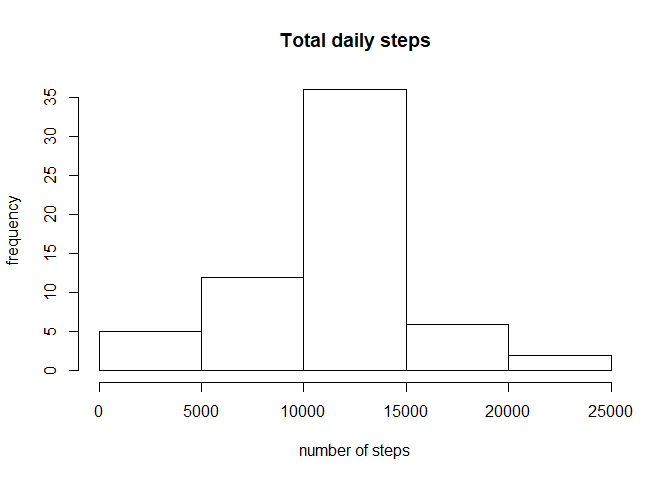

Loading and processing the Data set
-----------------------------------

### data base is read and the date column is converted into dates for analysis purposes.

    activity <- read.csv("activity.csv")
    activity$date <- as.Date(activity$date)
    str(activity)

    ## 'data.frame':    17568 obs. of  3 variables:
    ##  $ steps   : int  NA NA NA NA NA NA NA NA NA NA ...
    ##  $ date    : Date, format: "2012-10-01" "2012-10-01" ...
    ##  $ interval: int  0 5 10 15 20 25 30 35 40 45 ...

    names(activity)

    ## [1] "steps"    "date"     "interval"

What is mean total number of steps taken per day?
-------------------------------------------------

### Calculate the total number of steps taken per day

    dailyActivity <- sapply(split(activity$steps, activity$date),sum, na.rm=TRUE)

### Make a histogram of the total number of steps taken each day

    hist(dailyActivity, main= "Total daily steps", xlab = "number of steps", ylab = "frequency")

### Mean and Median number of daily steps.

    mean_dailyActivity <- mean(dailyActivity)
    median_dailyActivity <-median(dailyActivity)

    print(mean_dailyActivity)

    ## [1] 9354.23

    print(median_dailyActivity)

    ## [1] 10395

What is the average daily activity pattern?
-------------------------------------------

### plotting the interval activity time series

    intervalActivity <-sapply(split(activity$steps, activity$interval),mean, na.rm=TRUE)
    plot(intervalActivity, xlab="5-min intervals", type="l",ylab = "average daily steps", main="average number of interval steps")

### Identifiying the interval with the maximum average number of steps taken

    max_intervalID <- which.max(intervalActivity)

    names(max_intervalID)

    ## [1] "835"

Imputing the missing values
---------------------------

### Calculate and report the total number of missing values in the dataset

    sum(is.na(activity$steps))

    ## [1] 2304

### Filling strategy: replacing NA values with interval means.

#### 1-generating the NA free vector

    StepsAverage <- aggregate(steps ~ interval, data = activity, FUN = mean)
    fillNA <- numeric()
    for (i in 1:nrow(activity)) {
        obs <- activity[i, ]
        if (is.na(obs$steps)) {
            steps <- subset(StepsAverage, interval == obs$interval)$steps
        } else {
            steps <- obs$steps
        }
        fillNA <- c(fillNA, steps)
    }

#### 2-Generating a new database by replacing the steps column with the new NA free vector

    new_activity <- activity
    new_activity$steps <- fillNA

### - Generating daily activities and plotting the new data

    dailyActivity2 <-sapply(split(new_activity$steps, new_activity$date),sum, na.rm=TRUE)
    hist(dailyActivity2, main= "Total daily steps", xlab = "number of steps", ylab = "frequency")

### Calculating new means and medians

    mean_dailyActivity2 <- mean(dailyActivity2)
    median_dailyActivity2 <-median(dailyActivity2)

    print(mean_dailyActivity2)

    ## [1] 10766.19

    print(median_dailyActivity2)

    ## [1] 10766.19

Pattern difference in activity between weekdays and weekends
------------------------------------------------------------

### Generating weekday information

    new_activity$day <-weekdays(new_activity$date)  #generating an expanded database with variable day
    fill_weekday <-character()
                                        #loop to generate the weekend or weekday information based on day test
    for(i in 1:nrow(new_activity)){
          obs <-new_activity[i,]
          if (obs$day=="Saturday" | obs$day=="Sunday"){
                wday <-"Weekend"
          }else{
                wday <-"Weekday"
          }
          fill_weekday <-c(fill_weekday,wday)
    }

### Creating a new data base that contains weekday information

    activity2 <-new_activity
    activity2$weekday <-fill_weekday
    names(activity2)

    ## [1] "steps"    "date"     "interval" "day"      "weekday"

    str(activity2)

    ## 'data.frame':    17568 obs. of  5 variables:
    ##  $ steps   : num  1.717 0.3396 0.1321 0.1509 0.0755 ...
    ##  $ date    : Date, format: "2012-10-01" "2012-10-01" ...
    ##  $ interval: int  0 5 10 15 20 25 30 35 40 45 ...
    ##  $ day     : chr  "Monday" "Monday" "Monday" "Monday" ...
    ##  $ weekday : chr  "Weekday" "Weekday" "Weekday" "Weekday" ...

### Plotting

    dailysteps <- aggregate(steps ~ interval + weekday, data = activity2, mean)

    xyplot(steps ~ interval | weekday, dailysteps, type = "l", layout = c(1, 2), 
        xlab = "Interval", ylab = "Number of steps")

